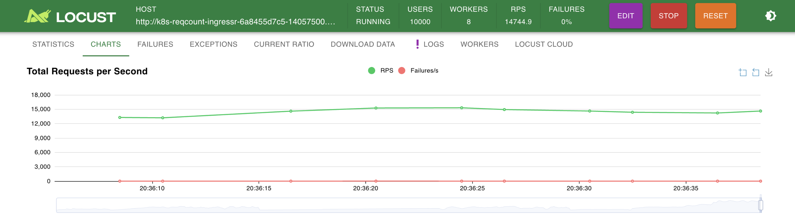

**Request Counter App on Kubernetes with Redis**
================================================

What the App Does
-----------------

The purpose of this repository is to showcase the basic knowledge I've gathered by utilizing common Kubernetes resources and concepts.

This microservice application tracks the number of PUT requests made to any given path. For each path, the system maintains a running count of the PUT requests and serves that information when queried via a GET request. It uses Redis as a fast, in-memory data store to track and store request counts for scalability and performance.

Key features:

-   PUT Request Handling: The service accepts PUT requests on any path and increments the request count for that specific path.

-   GET Request Handling: When queried via a GET request on a specific path (or the root path "/"), the service returns the total number of PUT requests made to that path (or across all paths, if the root is requested).


### Project Directory Structure


```
  │
  ├── app/                       # Main application folder (NestJS app)
  │   ├── src/                   # Source code for the NestJS app
  │   │   ├── modules/           # NestJS modules, controllers, services, etc.
  │   │   └── ...                # Other NestJS-related files
  │   ├── Dockerfile             # Dockerfile for building the app container
  │   ├── package.json           # Node.js dependencies and scripts
  │   ├── tsconfig.json          # TypeScript configuration
  │   └── ...                    # Other NestJS configuration files
  │
  ├── cloud-infrastructure/      # Infrastructure code (Terraform)
  │   ├── main.tf                # Terraform script to deploy EKS and other resources
  │
  ├── kubernetes/                # Kubernetes deployment manifests
  │   ├── aws/                   # Kubernetes manifests for deploying on AWS EKS
  │   │   ├── deployment.yaml    # Deployment configuration for the app in EKS
  │   │   ├── service.yaml       # Service definition for exposing the app in EKS
  │   │   ├── ingress.yaml       # Ingress configuration for routing traffic
  │   │   ├── redis.yaml         # Redis deployment and service configuration
  │   │   └── ...                # Other k8s-related YAML files for deployment
  │   ├── local/                 # Kubernetes manifests for local testing (e.g., Minikube, Docker Desktop)
  │   │   ├── deployment.yaml    # Deployment for local Kubernetes cluster
  │   │   ├── service.yaml       # Local service definition for the app
  │   │   ├── ingress.yaml       # Local ingress configuration
  │   │   └── redis.yaml         # Local Redis deployment configuration
  │   ├── tester/                # Folder for testing and load testing
  │   │   ├── locustfile.py       # Python script for load testing the app
  │
  └──
```

**Prerequisites**
-----------------

To use this repository, you will need the following tools installed on your local machine:

-   **Kubernetes**: Installed and configured with a working Kubernetes cluster locally or Cloud.
-   **kubectl**: to interact with the Kubernetes clusters.
-   **Terraform**: optional

**Installation**
----------------

###  **Set up for local testing environment**

`cd kubernetes/local `

`kubectl apply -f ./`

* * * * *

**Deployment to EKS**
---------------------

If you're deploying to AWS EKS and don't have a cluster (or don't want to use yours), you can use the provided *Terraform* configurations to provision the necessary infrastructure and deploy the app.

### **Deploy the app to EKS**


`cd kubernetes/aws `

`kubectl apply -f ./`

This will create the necessary resources: Deployment, Service, Ingress, and Redis, Auto Scaler, ALB, etc.

### **Accessing the app**

Once everything is deployed, the app should be accessible through the ALB. You can get the public URL by running:


`kubectl get ingress`

### Kubernetes Architecture:

-   Multi-Pod, Multi-Node Deployment: The app is designed to scale horizontally by deploying it in multiple pods across multiple nodes. This ensures that even under heavy traffic, the system remains responsive and available.

-   Auto-Scaling: Horizontal Pod Autoscaler (HPA) is set up to scale the pods automatically based on CPU utilization, allowing the system to handle spikes in traffic.

-   Redis: Redis is used as a fast, in-memory key-value store. By using Redis, we can handle a high volume of requests with minimal latency and persistent state across service instances.

-   Ingress: An Ingress resource is used to expose the service to external traffic, providing a single entry point to the application while allowing flexible routing and load balancing.

-   Auto-Scaling: By using Kubernetes' Horizontal Pod Autoscaler, the system ensures that resources are allocated dynamically based on traffic load, preventing over-provisioning during low traffic periods, which helps in reducing costs.

-   Efficient Redis Usage: Redis, being an in-memory data store, ensures minimal read/write latency, which translates to high performance and reduced compute resource usage.


While the current setup addresses the requirements of the challenge, there are several areas for potential improvements:

1.  Rate Limiting: Adding rate limiting on the PUT requests would help prevent abuse or accidental spikes in traffic from overloading the system.

2.  Request Persistence: Currently, Redis is used as the data store, but it is an in-memory solution. Adding persistence mechanisms to Redis or introducing a more durable data store could improve reliability in case of Redis restarts.

3.  Load Testing Results: Although the system is designed to handle at least 1 million requests per second, conducting formal load testing and sharing those results would help validate the system's performance claims.

4.  Distributed Redis: For even better scalability and fault tolerance, consider using a Redis Cluster setup rather than a single Redis instance.

5.  CI/CD Pipeline: Introducing a fully automated CI/CD pipeline with tools like GitHub Actions or Jenkins would streamline the development, testing, and deployment process.

6.  Logging and Monitoring: Adding centralized logging (e.g., with ELK stack or CloudWatch) and monitoring (e.g., Prometheus + Grafana) would help track the system's health and performance, ensuring issues can be identified and addressed quickly.

7.  Versioning API: For future extensibility, adding versioning to the API would allow backward compatibility as the application evolves.

8.  Security Enhancements: Implementing security best practices, such as using secrets management for sensitive data, ensuring the ingress controller is properly secured, and employing network policies to control communication between services.

### Other possible solutions:
While adding to my Kubernetes knowledge, I've found other potentially better solutions that could also be suitable:

* Request Counter Middleware with Custom Ingress Controller: A custom ingress controller could handle request counter incrementation. However, this could become a bottleneck if not scalable or if it becomes blocking.

* Service Mesh: Using a service mesh (designed to handle high throughput) could be an alternative solution for managing request counting.

* Redis Master-Slave Architecture: Handle request writes only through the Redis master replica and reads through the replicas. This setup might not be ideal if replication issues arise.

* Alternative Data Stores: Instead of relying on Redis, a more highly scalable database like RDS or DynamoDB could be used.

* Decouple Data Ingress: If real-time post-counting isn't necessary, data ingress can be decoupled and handled by a separate service that collects requests from existing monitoring tools (e.g., CloudWatch, Prometheus).


Below is provided small scale test (to keep personal aws costs low), handling ~15k RPS.


